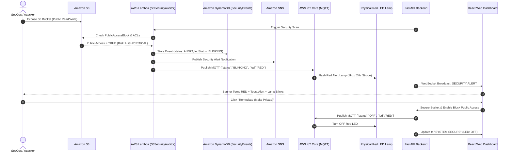

# Cloud Security Alert Lamp 🚨

> **AWS S3 Public Bucket Detection & Real-Time IoT Security Alert Lamp Monitoring System**

A modern full-stack cybersecurity application that continuously audits Amazon S3 buckets for public-access security risks. When an unauthenticated public bucket exposure is detected, AWS Lambda records the event in Amazon DynamoDB, publishes an alert to Amazon SNS, and commands a physical red alert lamp (via AWS IoT Core MQTT) to start **BLINKING**. Once the bucket is secured, the system automatically restores to **SYSTEM SECURE** and turns the red LED **OFF**.

---

## 🏛️ Architecture Overview

```
                      +-----------------------------+
                      |   Amazon S3 Storage Buckets |
                      +--------------+--------------+
                                     | (Audit Check)
                                     v
                       +---------------------------+
                       |    AWS Lambda Function    |
                       |    (S3SecurityAuditor)    |
                       +-------------+-------------+
                                     |
         +---------------------------+---------------------------+
         |                           |                           |
         v                           v                           v
+------------------+       +-------------------+       +-------------------+
|  Amazon DynamoDB |       |     Amazon SNS    |       |    AWS IoT Core   |
| (SecurityEvents) |       | (Security Alerts) |       |   (MQTT Broker)   |
+--------+---------+       +-------------------+       +---------+---------+
         |                                                       |
         | (Audit History & Alerts)                              | (Topic: security/alert/led)
         v                                                       v
+-------------------------------+                     +----------------------+
|    FastAPI Python Backend     |<====================|  Physical Red LED    |
|    (REST API + WebSockets)    |                     |  Raspberry Pi / ESP32|
+---------------+---------------+                     +----------------------+
                | (Real-Time Live Telemetry)
                v
+-------------------------------+
|     React.js Web Dashboard    |
|  (Cybersecurity Dark UI)      |
+-------------------------------+
```

### Complete Sequence Flow


---

## 🚀 Key Features

* **Real-Time S3 Security Auditing**:
  * Evaluates S3 `PublicAccessBlockConfiguration` (`BlockPublicAcls`, `IgnorePublicAcls`, `BlockPublicPolicy`, `RestrictPublicBuckets`).
  * Inspects `PolicyStatus.IsPublic` and checks ACL grants for `AllUsers` and `AuthenticatedUsers`.
  * Categorizes risk into `CRITICAL`, `HIGH`, `MEDIUM`, and `LOW`.
* **Authoritative Physical Lamp State Management**:
  * Frontend receives the physical LED state directly from the backend rather than guessing it.
  * Dedicated LED Status room with a realistic 3D industrial lamp graphic and visual halo pulse.
* **Dual Execution Modes**:
  * **Live AWS Mode**: Connects directly to Amazon S3, AWS Lambda, DynamoDB, SNS, and AWS IoT Core.
  * **College Lab / Demo Mode**: Built-in zero-cost simulation mode allowing students and professors to demonstrate the complete 9-step scenario without AWS credit card charges or active internet hardware.
* **Modern Cybersecurity Web Dashboard**:
  * Dark cyber theme with emerald green (`SYSTEM SECURE`) and pulsing crimson (`SECURITY ALERT`).
  * Interactive charts powered by Recharts (Doughnut distribution, Status comparison bar chart, and Alert history timeline).
  * S3 Bucket Explorer with search, filters, and modal inspection.
  * Incident response workflow: **Acknowledge** and **Remediate (Make Private)** with 1-click.
  * Searchable Event History audit trail with CSV export.

---

## 📁 Project Directory Structure

```text
cloud-security-alert-lamp/
├── frontend/                     # Modern React + Vite Dashboard
│   ├── src/
│   │   ├── charts/               # Recharts security charts
│   │   │   └── SecurityCharts.jsx
│   │   ├── components/           # UI components
│   │   │   ├── BucketDetailModal.jsx
│   │   │   ├── DemoControlBar.jsx
│   │   │   ├── Header.jsx
│   │   │   ├── LedLampVisualizer.jsx
│   │   │   └── SummaryCards.jsx
│   │   ├── pages/                # Page views
│   │   │   ├── AlertsPage.jsx
│   │   │   ├── BucketsPage.jsx
│   │   │   ├── DashboardPage.jsx
│   │   │   ├── EventsPage.jsx
│   │   │   ├── LedStatusPage.jsx
│   │   │   └── SystemInfoPage.jsx
│   │   ├── services/             # API client & WebSocket sync
│   │   │   └── api.js
│   │   ├── App.jsx               # Navigation router & toast alerts
│   │   ├── index.css             # Cyber dark theme design system
│   │   └── main.jsx
│   ├── index.html
│   ├── package.json
│   └── vite.config.js
│
├── backend/                      # Python FastAPI Backend
│   ├── aws/                      # Boto3 AWS integrations
│   │   ├── client_factory.py     # AWS client factory with mock fallback
│   │   ├── create_dynamodb_table.py
│   │   ├── dynamodb_service.py   # DynamoDB SecurityEvents table
│   │   ├── iot_service.py        # AWS IoT Core MQTT publisher
│   │   ├── s3_service.py         # S3 public access block auditor
│   │   └── sns_service.py        # SNS push notifications
│   ├── models/
│   │   └── schemas.py            # Pydantic data schemas
│   ├── routes/                   # REST API routes
│   │   ├── alerts.py
│   │   ├── buckets.py
│   │   ├── dashboard.py
│   │   ├── demo.py
│   │   ├── events.py
│   │   └── led.py
│   ├── services/
│   │   ├── auditor_service.py
│   │   ├── led_service.py
│   │   └── mock_data_service.py
│   ├── .env.example
│   ├── main.py                   # FastAPI entrypoint & WebSocket manager
│   ├── README.md
│   └── requirements.txt
│
├── lambda/                       # AWS Lambda Serverless Function
│   ├── s3_security_auditor.py    # S3 Security Auditor function code
│   └── README.md                 # IAM policies & deployment guide
│
├── iot/                          # Physical IoT Microcontroller Firmware
│   ├── esp32_firmware.ino        # ESP32 WiFi + MQTT firmware
│   ├── led_controller.py         # Raspberry Pi & Desktop Terminal Simulator
│   └── README.md                 # Hardware wiring pinout diagrams
│
├── run_demo.bat                  # 1-Click Windows Launcher
├── run_demo.ps1                  # PowerShell Launcher
└── README.md                     # Complete Documentation
```

---

## ⚡ Quickstart (Running Locally in 2 Minutes)

### Option 1: 1-Click Launch (Windows)
Double-click `run_demo.bat` or run:
```powershell
.\run_demo.ps1
```
This automatically starts the FastAPI backend, starts the Vite frontend, and opens `http://localhost:5173` in your default browser.

---

### Option 2: Manual Step-by-Step Launch

#### 1. Setup Backend
```bash
# In project root
# Activate virtual environment:
.\venv\Scripts\activate          # Windows PowerShell
source ./venv/bin/activate       # Linux / macOS

# Install backend dependencies (if not already installed):
pip install -r backend/requirements.txt

# Start backend server:
cd backend
python main.py
# Backend runs at http://localhost:8000
# Interactive Swagger API Docs: http://localhost:8000/docs
```

#### 2. Setup Frontend
```bash
cd frontend
npm install
npm run dev
# Dashboard runs at http://localhost:5173
```

#### 3. Run Physical LED Controller / Desktop Simulator
```bash
# In a new terminal window:
.\venv\Scripts\python.exe iot\led_controller.py
```
* If executed on a **Raspberry Pi**, it automatically connects to GPIO Pin 17.
* If executed on a **PC/Mac**, it runs a visual terminal lamp strobe simulator with live alerts.

---

## 🎓 9-Step College Demonstration Scenario (Section 20)

Follow these exact steps during your college project presentation or viva:

| Step | Action | Expected System Reaction |
|---|---|---|
| **Step 1** | Open the dashboard at `http://localhost:5173` | Displays **SYSTEM SECURE**. Summary shows 0 Public Buckets. Security Alert Lamp shows **OFF**. |
| **Step 2** | Click **"Simulate Public Bucket"** in the demo control bar | Simulates an unauthenticated public bucket exposure on `college-project-bucket`. |
| **Step 3** | AWS Lambda security scan runs automatically | The security auditor checks bucket policy, ACL grants, and public access blocks. |
| **Step 4** | AWS Lambda detects the public bucket | Identifies disabled public access blocks and marks risk level as **HIGH**. |
| **Step 5** | Dashboard state updates immediately via WebSocket | Main status panel turns into **SECURITY ALERT** with crimson pulse. |
| **Step 6** | Alert notification appears | Displays: `⚠️ SECURITY ALERT: Public S3 Bucket Detected`, showing bucket name, region (`ap-south-1`), and risk. |
| **Step 7** | Physical Red LED starts **BLINKING** | AWS IoT Core dispatches MQTT message `{"status": "BLINKING"}`. Raspberry Pi GPIO / Desktop simulator flashes red. |
| **Step 8** | Event recorded in DynamoDB & Event History | Navigate to **Event History** tab to view the recorded events: `Public Access Detected` & `LED Activated`. |
| **Step 9** | Click **"Remediate & Turn LED OFF"** | Enables Block Public Access. System restores to **SYSTEM SECURE** and the red LED turns **OFF**. |

---

## ☁️ AWS Cloud Production Deployment Guide

### 1. Amazon DynamoDB Table Setup
Create the `SecurityEvents` table in your target AWS region:
```bash
# Set your region (e.g. ap-south-1)
set AWS_DEFAULT_REGION=ap-south-1
python backend/aws/create_dynamodb_table.py
```

### 2. Amazon SNS Setup
Create an SNS topic for push notifications:
```bash
aws sns create-topic --name S3SecurityAlerts --region ap-south-1
# Subscribe your email to the topic:
aws sns subscribe --topic-arn arn:aws:sns:ap-south-1:ACCOUNT_ID:S3SecurityAlerts --protocol email --notification-endpoint your_email@example.com
```

### 3. AWS Lambda Function Deployment
1. Open the **AWS Lambda Console** and click **Create function**.
2. Name: `S3SecurityAuditor`
3. Runtime: **Python 3.12**
4. Copy the code from `lambda/s3_security_auditor.py` into the Lambda code editor.
5. In **Configuration -> Environment Variables**, configure:
   * `DYNAMODB_TABLE_NAME`: `SecurityEvents`
   * `SNS_TOPIC_ARN`: `arn:aws:sns:ap-south-1:ACCOUNT_ID:S3SecurityAlerts`
   * `AWS_IOT_TOPIC`: `security/alert/led`
6. Attach the IAM policy provided in `lambda/README.md` to the Lambda execution role.
7. Add an **EventBridge (CloudWatch Events)** trigger with rate `rate(5 minutes)` or S3 CloudTrail events.

### 4. AWS IoT Core Setup (for Physical Lamp)
1. Go to **AWS IoT Core -> Manage -> Things** and create a Thing named `SecurityAlertLamp`.
2. Generate certificates: download `certificate.pem.crt`, `private.pem.key`, and `AmazonRootCA1.pem`.
3. Create an IoT policy allowing `iot:Connect`, `iot:Subscribe`, and `iot:Receive` on `security/alert/led`.
4. Place certificates into `iot/certs/` on your Raspberry Pi.

---

## 🔌 Physical Hardware Wiring Diagram

### Raspberry Pi (GPIO Pin 17)
```
  Raspberry Pi 4 / 3B+
  +-------------------------------------+
  | Pin 6  (GND)    -----> Red LED Cathode (-) (Flat edge)
  | Pin 11 (GPIO17) -----> 330 Ohm Resistor -----> Red LED Anode (+)
  +-------------------------------------+
```

### ESP32 Microcontroller
```
  ESP32 Board
  +-------------------------------------+
  | GND             -----> Both LEDs Cathode (-)
  | GPIO 23         -----> 330 Ohm Resistor -----> Red Alert LED Anode (+)
  | GPIO 22         -----> 330 Ohm Resistor -----> Green Secure LED Anode (+)
  +-------------------------------------+
```

---

## 🌐 API Documentation Reference

Interactive OpenAPI Swagger documentation is available at:
`http://localhost:8000/docs`

| Method | Endpoint | Description |
|---|---|---|
| `GET` | `/api/dashboard` | Returns summary metrics, primary alert bucket, system status, and LED state |
| `GET` | `/api/buckets` | Returns monitored S3 buckets list with filters and search |
| `GET` | `/api/buckets/{name}` | Returns detailed security posture and Public Access Block flags for a bucket |
| `POST` | `/api/scan` | Initiates an immediate AWS security audit across monitored S3 buckets |
| `GET` | `/api/alerts` | Returns all detected security alerts |
| `POST` | `/api/alerts/{id}/remediate` | Secures the exposed bucket and resets the LED to OFF |
| `GET` | `/api/events` | Returns the security event history with filters (All, Secure, Warning, Critical) |
| `GET` | `/api/led-status` | Returns the authoritative physical LED state |
| `POST` | `/api/led` | Updates or tests the LED state |
| `POST` | `/api/demo/toggle-bucket` | Toggles an S3 bucket to public/private to trigger the pipeline |
| `POST` | `/api/demo/reset` | Resets the demo environment to Step 1 (System Secure, LED OFF) |
| `WS` | `/ws` | Real-time WebSocket connection for live telemetry broadcast |

### Sample cURL Commands

**Check Dashboard State:**
```bash
curl -X GET http://localhost:8000/api/dashboard
```

**Trigger S3 Audit Scan:**
```bash
curl -X POST http://localhost:8000/api/scan -H "Content-Type: application/json" -d "{}"
```

**Simulate Public S3 Bucket Exposure:**
```bash
curl -X POST http://localhost:8000/api/demo/toggle-bucket -H "Content-Type: application/json" -d "{\"bucketName\": \"college-project-bucket\", \"makePublic\": true}"
```

**Reset to System Secure:**
```bash
curl -X POST http://localhost:8000/api/demo/reset -H "Content-Type: application/json"
```

---

## 🛡️ Security Best Practices Followed (Section 17)
- **Zero Hardcoded Secrets**: AWS credentials are never hardcoded in source code; IAM roles and `.env` variables are utilized.
- **Principle of Least Privilege**: IAM policies grant only specific S3 read-only audit permissions and scoped DynamoDB/SNS access.
- **Separation of Concerns**: The frontend never has direct access to AWS credentials or S3 modifications; all operations are mediated by the backend security workflow.
- **Friendly Error Handling**: Friendly, clear messages are displayed to users instead of technical stack traces.
